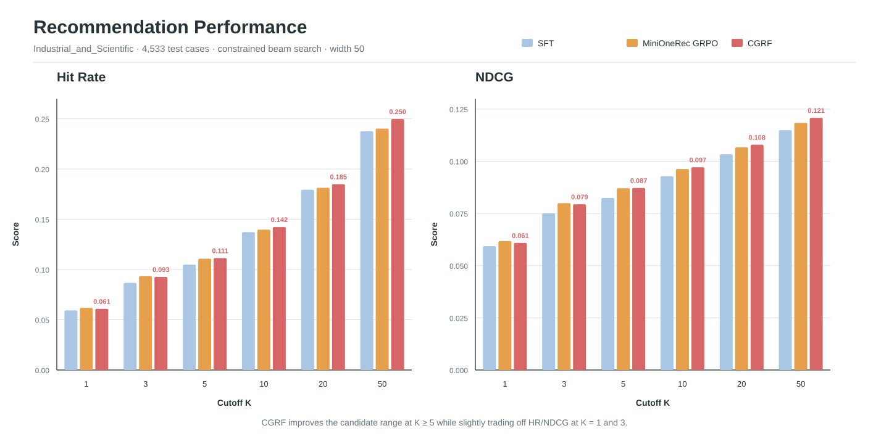
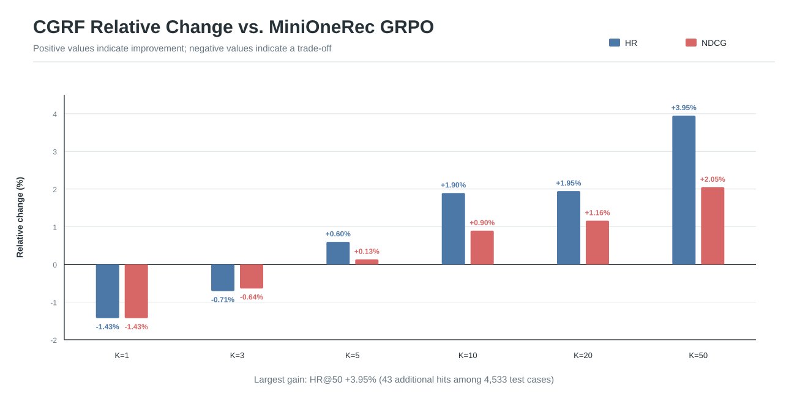
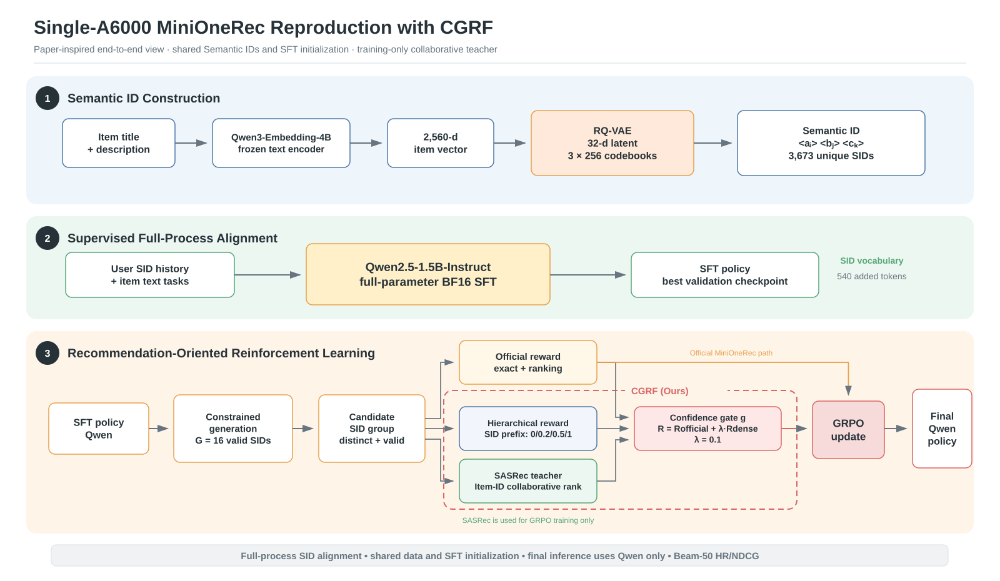

# MiniOneRec 生成式推荐与 CGRF-H 奖励优化

本项目基于 MiniOneRec 官方固定版本 [`0c64b955ecb8e3d7a9ae9f1fa88cf938f129b0ed`](https://github.com/AkaliKong/MiniOneRec/tree/0c64b955ecb8e3d7a9ae9f1fa88cf938f129b0ed)，在单张 NVIDIA RTX A6000 上实现从数据处理、Semantic ID（SID）构建、监督微调（SFT）、GRPO 到 Top-K 评测的完整生成式推荐流程。在此基础上，设计 CGRF-H（Confidence-Gated Collaborative and Hierarchical Reward），通过置信门控融合 SASRec 协同信号与 SID 层级语义，优化 GRPO 的奖励质量。

## 1. 核心结果

所有模型均使用相同的数据划分、SFT 初始化和评测配置。测试集包含 4,533 条样本，采用受约束 beam search 生成 50 个候选。

**Hit Rate（HR）**

| 指标 | SFT | MiniOneRec GRPO | CGRF-H | 相对 GRPO 变化 |
| --- | ---: | ---: | ---: | ---: |
| HR@1 | 0.059343 | **0.061769** | 0.060887 | -1.429% |
| HR@3 | 0.086698 | **0.093316** | 0.092654 | -0.709% |
| HR@5 | 0.104787 | 0.110743 | **0.111405** | **+0.598%** |
| HR@10 | 0.137216 | 0.139643 | **0.142290** | **+1.896%** |
| HR@20 | 0.179351 | 0.181337 | **0.184867** | **+1.946%** |
| HR@50 | 0.237591 | 0.240238 | **0.249724** | **+3.949%** |

**Normalized Discounted Cumulative Gain（NDCG）**

| 指标 | SFT | MiniOneRec GRPO | CGRF-H | 相对 GRPO 变化 |
| --- | ---: | ---: | ---: | ---: |
| NDCG@1 | 0.059343 | **0.061769** | 0.060887 | -1.429% |
| NDCG@3 | 0.075042 | **0.079940** | 0.079428 | -0.641% |
| NDCG@5 | 0.082456 | 0.087088 | **0.087204** | **+0.133%** |
| NDCG@10 | 0.092869 | 0.096283 | **0.097147** | **+0.897%** |
| NDCG@20 | 0.103357 | 0.106690 | **0.107928** | **+1.160%** |
| NDCG@50 | 0.114912 | 0.118380 | **0.120805** | **+2.048%** |





CGRF-H 的收益主要体现在较大的候选范围：HR@10、HR@20 和 HR@50 分别比 MiniOneRec GRPO 多命中 12、16 和 43 条测试样本，其中 HR@50、NDCG@50 相对提升 3.95% 和 2.05%。HR@1 和 HR@3 略有下降，说明当前奖励更有利于扩大高质量候选覆盖，Top-1 排序仍有进一步调优空间。

> 当前结果来自 `Industrial_and_Scientific` 数据集、单个随机种子的一次正式训练，未进行显著性检验。

## 2. 系统设计

MiniOneRec 将下一商品推荐转化为受约束序列生成：先将商品压缩成三个离散 SID token，再让语言模型根据用户历史生成下一商品的 SID。项目主线如下：

```text
Amazon18 Reviews + Metadata
    ↓ 5-core 过滤、序列构造、全局时间切分
商品标题 + 描述
    ↓ Qwen3-Embedding-4B
2,560 维商品嵌入
    ↓ RQ-VAE（32 维隐空间，3 × 256 码本）
Semantic ID
    ↓ Qwen2.5-1.5B-Instruct 全参数 BF16 SFT
SFT 推荐模型
    ├── 精确匹配奖励 + 排名奖励 ─────────→ MiniOneRec GRPO
    └── SASRec 教师 + CGRF-H 奖励 ─────→ CGRF-H
                                                ↓
                                      统一 Beam-50 评测
```



系统图按照 [MiniOneRec 论文 Figure 2](https://arxiv.org/abs/2510.24431) 的阶段划分绘制。红色虚线框表示本项目新增的 CGRF-H 奖励模块；SASRec 只在强化学习阶段提供奖励，最终推理仍由微调后的 Qwen 模型独立完成，因此不会增加推理时延和部署参数量。

### 2.1 MiniOneRec 基线

基线包含三个阶段：

1. **SID 构建**：使用 Qwen3-Embedding-4B 编码商品标题和描述，通过 RQ-VAE 将连续语义向量量化为三层 SID。
2. **SFT**：扩展 Qwen2.5-1.5B-Instruct 词表，联合训练下一 SID 预测、SID 与标题对齐、SID 历史到下一标题三类任务。
3. **GRPO**：每个 prompt 通过受约束 beam search 生成 16 个合法候选，使用精确匹配奖励与排名奖励计算组内相对优势。

### 2.2 CGRF-H 奖励

MiniOneRec 论文曾尝试直接使用冻结 SASRec 的原始 logit 作为协同奖励，但实验出现奖励目标与推荐准确率不一致的问题。CGRF-H 不直接使用原始 logit，而是在保留基线奖励的基础上加入经过归一化和置信校准的稠密奖励：

```text
R = R_base + λ × [g × R_collaborative + (1 - g) × R_hierarchical]
```

- `R_base`：MiniOneRec 的精确匹配奖励与排名奖励。
- `R_collaborative`：将冻结 SASRec 对 16 个候选的分数转换为 `[0, 1]` 组内排名百分位，避免原始 logit 尺度波动直接影响 GRPO。
- `R_hierarchical`：候选 SID 与目标 SID 共享 0、1、2、3 层前缀时，分别赋予 `0、0.2、0.5、1.0`。
- `g`：由真实目标在 SASRec 排序中的位置计算。教师越可靠，越侧重协同奖励；否则回退到 SID 层级奖励。
- `λ`：稠密奖励权重，正式实验设置为 `0.1`。

SASRec 以 `history_item_id → item_id` 训练，Qwen 则生成 SID。程序通过 `index.json` 建立 `SID → [Item ID, ...]` 反向映射。若一个 SID 对应多个商品，使用以下方式聚合协同分数：

```text
SID_score = logsumexp(item_logits) - log(item_count)
```

该式等价于商品指数分数均值的对数，既保留高分商品的影响，也避免碰撞组仅因包含更多商品而获得额外优势。

### 2.3 离线奖励回放

正式训练前，冻结 SFT 模型和 SASRec，在固定的 2,000 个 prompt 上缓存每组 16 个候选，比较 `λ=0.1、0.2、0.3` 时奖励的数值稳定性、候选区分能力和精确目标排序。正式实验采用较保守的 `λ=0.1`，用于限制新增奖励对原有策略的扰动。奖励回放只用于训练前分析，不更新模型参数，也不参与最终评测。

## 3. 数据与中间结果

### 3.1 数据处理

数据处理采用 Amazon18 `Industrial_and_Scientific`：用户和商品均执行 5-core 过滤，根据目标交互时间对 next-item 样本稳定排序并按 `80% / 10% / 10%` 切分。每条样本只保留最近 10 个历史商品。

| 统计项 | 数值 |
| --- | ---: |
| 用户数 | 7,694 |
| 商品数 | 3,686 |
| 过滤后交互数 | 53,018 |
| next-item 样本数 | 45,324 |
| train / valid / test | 36,259 / 4,532 / 4,533 |

| 序列统计 | 最短 | 平均 | 最长 |
| --- | ---: | ---: | ---: |
| 用户完整交互序列 | 5 | 6.8908 | 88 |
| 样本历史（截断前） | 1 | 4.3768 | 87 |
| 样本历史（截断后） | 1 | 3.9759 | 10 |

共有 2,664 条样本发生历史截断，占全部样本的 5.88%。截断只移除更早的交互，保留时间顺序和最近行为。

### 3.2 商品嵌入与 RQ-VAE

Qwen3-Embedding-4B 对标题和描述进行编码，使用 attention mask 加权平均池化得到商品向量。模型以 FP16 推理，最终保存为 float32 矩阵。

| 指标 | 结果 |
| --- | ---: |
| Embedding shape | `(3686, 2560)` |
| RQ-VAE 最佳 loss | 0.520868（第 2,438 轮） |
| 选用 checkpoint | 第 9,950 轮 |
| Sinkhorn 前碰撞率 | 12.8052% |
| Sinkhorn 后碰撞率 | 0.3527% |
| 唯一 SID 数 | 3,673 |

| RQ-VAE 层 | 已使用 code | code 总数 | 利用率 |
| --- | ---: | ---: | ---: |
| 第 1 层 | 28 | 256 | 10.94% |
| 第 2 层 | 256 | 256 | 100% |
| 第 3 层 | 256 | 256 | 100% |

第一层主要承担粗粒度语义划分，而第二、三层继续量化残差；当前商品规模较小，且训练目标没有显式的码本均衡约束，因此第一层容易集中使用少量 code。较低利用率会降低粗粒度语义簇的表达丰富度，但本实验第二、三层均实现完整覆盖，Sinkhorn 处理后碰撞率降至 0.3527%，能够支撑后续训练。码本利用率仅表示 code 是否被使用，不等同于占用分布均衡。

### 3.3 SFT 数据

| 任务 | 训练样本数 | 目标 |
| --- | ---: | --- |
| 下一 SID 预测 | 36,259 | SID 历史 → 下一 SID |
| 商品识别与对齐 | 7,319 | SID ↔ 商品标题 |
| 标题预测 | 36,259 | SID 历史 → 下一标题 |
| 合计 | 79,837 | 三类任务联合训练 |

商品识别与对齐任务会对重复标题进行去重，避免同一文本输入对应多个冲突目标，因此其样本数小于商品数双向展开后的理论值。验证集包含 4,532 条下一 SID 预测样本。

## 4. 代码结构

```text
minionerec/
├── scripts/                         # 基线流程命令行入口
├── src/minionerec/
│   ├── data/                        # 数据预处理与 SFT/GRPO 数据集
│   ├── semantic_id/                 # 商品嵌入、RQ-VAE、SID 生成
│   ├── training/                    # SFT 与 GRPO
│   ├── generation/                  # 受约束生成与 beam search
│   ├── rewards/                     # MiniOneRec 排名奖励
│   └── evaluation/                  # HR/NDCG 评测
├── innovations/
│   └── cgrf_hierarchical_grpo/      # SASRec、奖励融合与 CGRF-H 训练
├── assets/figures/                  # 系统图和实验图
├── requirements-a6000.txt
└── README.md
```

| 阶段 | 入口 | 主要输入 | 主要输出 |
| --- | --- | --- | --- |
| 数据预处理 | `scripts/prepare_amazon.py` | reviews、metadata | `.inter`、商品与 ID 映射 |
| 数据统计 | `scripts/generate_data_statistics.py` | 处理后数据 | `.data_stats.json` |
| 商品嵌入 | `scripts/generate_item_embeddings.py` | 商品文本、Qwen3 | `.npy` |
| RQ-VAE | `scripts/train_rqvae.py` | 商品嵌入 | `rqvae_model.pth` |
| SID 生成 | `scripts/generate_semantic_ids.py` | 嵌入、RQ-VAE | `index.json` |
| 数据转换 | `scripts/convert_dataset.py` | 交互、商品、SID | train/valid/test CSV |
| SFT | `scripts/train_sft.py` | Qwen2.5、训练数据 | `final_model/` |
| MiniOneRec GRPO | `scripts/train_grpo.py` | SFT 模型、GRPO 数据 | `final_model/` |
| 统一评测 | `scripts/evaluate_sft.py` | 最终模型、测试集 | HR/NDCG JSON |
| SASRec 教师 | `innovations/.../train_sasrec.py` | Item ID 序列 | SASRec checkpoint |
| 奖励回放 | `innovations/.../analyze_rewards.py` | SFT、SASRec、固定候选 | 奖励分析 JSON |
| CGRF-H GRPO | `innovations/.../train_cgrf_grpo.py` | SFT、SASRec、GRPO 数据 | `final_model/` |

`scripts/` 负责参数解析和流程入口，核心实现位于 `src/minionerec/`；创新模块复用同一套数据、生成和评测代码，只替换 GRPO 的奖励构造。

## 5. 运行流程

以下命令从仓库根目录执行：

```bash
cd /home/user/wbn/minionerec
source .venv-a6000/bin/activate

MINIONE_CATEGORY=Industrial_and_Scientific
MINIONE_PROCESSED=artifacts/data/processed/amazon18/Industrial_and_Scientific
MINIONE_FINAL=artifacts/data/final/amazon18
MINIONE_FINAL_NAME=Industrial_and_Scientific_5_1996-10-2018-11
```

### 5.1 数据预处理

```bash
python scripts/prepare_amazon.py \
  --dataset "$MINIONE_CATEGORY" \
  --metadata-file artifacts/data/raw/amazon18/Industrial_and_Scientific/meta_Industrial_and_Scientific.json \
  --reviews-file artifacts/data/raw/amazon18/Industrial_and_Scientific/Industrial_and_Scientific_5.json \
  --output-root artifacts/data/processed/amazon18

python scripts/generate_data_statistics.py \
  --data-dir "$MINIONE_PROCESSED" \
  --dataset-name "$MINIONE_CATEGORY"
```

### 5.2 商品嵌入

```bash
CUDA_VISIBLE_DEVICES=0 HF_HUB_OFFLINE=1 TRANSFORMERS_OFFLINE=1 \
python scripts/generate_item_embeddings.py \
  --item-file "$MINIONE_PROCESSED/$MINIONE_CATEGORY.item.json" \
  --item-mapping-file "$MINIONE_PROCESSED/$MINIONE_CATEGORY.item2id" \
  --model-path artifacts/models/Qwen3-Embedding-4B \
  --output-file "$MINIONE_PROCESSED/$MINIONE_CATEGORY.emb-qwen-td.npy" \
  --batch-size 8 \
  --max-length 2048 \
  --device cuda:0 \
  --torch-dtype float16
```

### 5.3 RQ-VAE 与 SID 生成

```bash
CUDA_VISIBLE_DEVICES=0 python scripts/train_rqvae.py \
  --embedding-file "$MINIONE_PROCESSED/$MINIONE_CATEGORY.emb-qwen-td.npy" \
  --output-dir results/rqvae/Industrial_and_Scientific \
  --epochs 10000 \
  --batch-size 20480 \
  --eval-step 50 \
  --device cuda:0

CUDA_VISIBLE_DEVICES=0 python scripts/generate_semantic_ids.py \
  --embedding-file "$MINIONE_PROCESSED/$MINIONE_CATEGORY.emb-qwen-td.npy" \
  --checkpoint-file results/rqvae/Industrial_and_Scientific/rqvae_model.pth \
  --output-file "$MINIONE_PROCESSED/$MINIONE_CATEGORY.index.json" \
  --statistics-file "$MINIONE_PROCESSED/$MINIONE_CATEGORY.index.stats.json" \
  --device cuda:0
```

### 5.4 训练数据转换

```bash
python scripts/convert_dataset.py \
  --data-dir "$MINIONE_PROCESSED" \
  --dataset-name "$MINIONE_CATEGORY" \
  --output-dir "$MINIONE_FINAL" \
  --output-name "$MINIONE_FINAL_NAME"
```

### 5.5 SFT

```bash
CUDA_VISIBLE_DEVICES=0 HF_HUB_OFFLINE=1 TRANSFORMERS_OFFLINE=1 \
python -u scripts/train_sft.py \
  --model-path artifacts/models/Qwen2.5-1.5B-Instruct \
  --train-file "$MINIONE_FINAL/train/$MINIONE_FINAL_NAME.csv" \
  --valid-file "$MINIONE_FINAL/valid/$MINIONE_FINAL_NAME.csv" \
  --item-file "$MINIONE_PROCESSED/$MINIONE_CATEGORY.item.json" \
  --index-file "$MINIONE_PROCESSED/$MINIONE_CATEGORY.index.json" \
  --output-dir results/sft/Industrial_and_Scientific \
  --num-epochs 10 \
  --batch-size 128 \
  --micro-batch-size 4 \
  --learning-rate 3e-4 \
  --max-length 512
```

### 5.6 MiniOneRec GRPO

```bash
CUDA_VISIBLE_DEVICES=0 HF_HUB_OFFLINE=1 TRANSFORMERS_OFFLINE=1 \
python -u scripts/train_grpo.py \
  --model-path results/sft/Industrial_and_Scientific/final_model \
  --train-file "$MINIONE_FINAL/train/$MINIONE_FINAL_NAME.csv" \
  --valid-file "$MINIONE_FINAL/valid/$MINIONE_FINAL_NAME.csv" \
  --item-file "$MINIONE_PROCESSED/$MINIONE_CATEGORY.item.json" \
  --index-file "$MINIONE_PROCESSED/$MINIONE_CATEGORY.index.json" \
  --info-file "$MINIONE_FINAL/info/$MINIONE_FINAL_NAME.txt" \
  --output-dir results/grpo/Industrial_and_Scientific \
  --micro-batch-size 16 \
  --eval-batch-size 16 \
  --gradient-accumulation-steps 64 \
  --num-epochs 2 \
  --learning-rate 1e-5 \
  --num-generations 16 \
  --max-prompt-length 512 \
  --max-completion-length 128 \
  --temperature 1.0 \
  --beta 0.001
```

### 5.7 评测

SFT、MiniOneRec GRPO 与 CGRF-H 使用同一个评测入口，只需替换模型和输出路径：

```bash
CUDA_VISIBLE_DEVICES=0 HF_HUB_OFFLINE=1 TRANSFORMERS_OFFLINE=1 \
python scripts/evaluate_sft.py \
  --model-path results/grpo/Industrial_and_Scientific/final_model \
  --test-file "$MINIONE_FINAL/test/$MINIONE_FINAL_NAME.csv" \
  --info-file "$MINIONE_FINAL/info/$MINIONE_FINAL_NAME.txt" \
  --output-file results/evaluation/Industrial_and_Scientific/grpo_metrics.json \
  --batch-size 8 \
  --num-beams 50 \
  --max-new-tokens 256 \
  --length-penalty 0.0 \
  --device cuda:0
```

CGRF-H 的教师训练、奖励回放和正式训练命令见 [`innovations/cgrf_hierarchical_grpo/README.md`](innovations/cgrf_hierarchical_grpo/README.md)。

## 6. 实验配置与资源

### 6.1 运行环境

| 组件 | 已验证版本 |
| --- | --- |
| GPU | NVIDIA RTX A6000 48GB |
| Python | 3.11.5 |
| PyTorch | 2.6.0+cu124 |
| Transformers | 4.57.1 |
| TRL | 0.24.0 |
| 商品编码模型 | Qwen3-Embedding-4B |
| 推荐模型 | Qwen2.5-1.5B-Instruct |

完整依赖见 [`requirements-a6000.txt`](requirements-a6000.txt)。

### 6.2 关键参数

| 阶段 | 关键设置 |
| --- | --- |
| 数据 | 5-core；历史长度 ≤ 10；全局时间切分 `8:1:1` |
| 商品嵌入 | 最大长度 2,048；batch 8；FP16 推理；float32 保存 |
| RQ-VAE | `2560 → 32`；`3 × 256` 码本；10,000 轮；batch 20,480；学习率 `1e-3` |
| SFT | 全参数 BF16；micro batch 4；梯度累积 32；有效 batch 128；学习率 `3e-4` |
| GRPO | 16 个候选；micro batch 16；梯度累积 64；2 轮；学习率 `1e-5`；`β=1e-3` |
| SASRec | 最大序列 10；hidden size 32；2 层；2 heads；dropout 0.3；学习率 `1e-3` |
| CGRF-H | `λ=0.1`；其余配置与 MiniOneRec GRPO 一致 |
| 评测 | 4,533 条样本；受约束 Beam-50；batch 8 |

### 6.3 训练资源

| 阶段 | 训练结果 | 耗时 | 峰值显存 |
| --- | --- | ---: | ---: |
| 商品嵌入 | 3,686 件 | 143 秒 | 未记录 |
| SFT | 2,808 steps；最佳验证 loss 1.526703 | 2.99 小时 | 未记录 |
| MiniOneRec GRPO | 1,650 steps；2 轮 | 13.79 小时 | 10.88 GiB |
| SASRec | 最佳 epoch 66；NDCG@10 0.110354 | 30.7 秒 | 0.045 GiB |
| CGRF-H GRPO | 1,650 steps；2 轮 | 13.82 小时 | 10.88 GiB |

CGRF-H GRPO 与基线的训练耗时和显存基本一致；SASRec 参数量为 143,776，且不参与最终推理。

## 7. 实验范围

- 本项目完成 `Industrial_and_Scientific` 上的单卡完整流程，没有复现论文的全部数据集和模型规模。
- SFT 配置上限为 10 轮，验证早停后回载约 4.5 轮时的最佳权重；GRPO 从该模型继续训练 2 轮。
- 正式对比目前只有一个随机种子，结果用于验证当前配置下的方法有效性，不声明统计显著。
- `λ=0.2` 和 `0.3` 仅用于离线奖励分析，只有 `λ=0.1` 完成了下游训练，因此不声称其为全局最优值。

## 8. 参考资料

- [MiniOneRec 论文](https://arxiv.org/abs/2510.24431)
- [MiniOneRec 固定上游 commit](https://github.com/AkaliKong/MiniOneRec/tree/0c64b955ecb8e3d7a9ae9f1fa88cf938f129b0ed)
- [CGRF-H 实现与实验命令](innovations/cgrf_hierarchical_grpo/README.md)
- [MiniOneRec License](LICENSE-MiniOneRec.txt)
