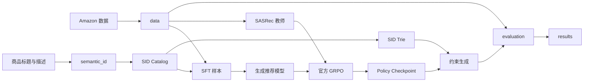

# 系统架构

## 目标

本项目采用“数据契约驱动”的单卡流水线。模型、训练、生成、奖励和评测互相解耦，从而能够判断结果差异来自算法还是单卡工程改造。

## 模块关系

## 核心模块

### `data`

定义交互序列、时间切分、`history -> target`、prompt、标签和 batch。实际数据保存在 `artifacts/datasets/`，不能放进 Python 包。

### `semantic_id`

负责商品文本 embedding、RQ-VAE、三层 Semantic ID、codebook 诊断、SID 碰撞统计和合法目录导出。

### `models`

只定义 Qwen2.5 生成模型和 SASRec 教师的前向接口，不包含训练循环。

### `rewards`

复现阶段只实现官方 exact、ranking 和 raw collaborative 奖励。CGRF 必须在官方基线验收后单独加入。

### `generation`

负责 SID Trie、受约束 rollout、确定性 Beam Search、输出解析、去重和合法性检查。禁止用随机商品替换非法生成。

### `training`

负责单进程 BF16、梯度累积、gradient checkpointing、SDPA、SFT、SASRec 和官方 GRPO 的编排。

### `evaluation`

所有模型共享同一套 HR、NDCG、合法率、覆盖率、长尾和效率指标，避免不同脚本使用不同协议。

## 运行时边界

- SASRec 和奖励仅参与训练，不进入正式推理。
- 正式推理只需要生成模型、SID Catalog 和 Trie。
- 配置决定一次运行，manifest 记录配置、代码版本、数据哈希和硬件。
- 训练依赖安装在项目私有的 `.venv-a6000/`，不使用共享 Conda 环境。
- `artifacts/` 保存大文件；`results/` 只保存可审阅的小型摘要。

## 环境边界

- `environment/` 保存可提交的环境说明、安装脚本和精确依赖锁。
- `.venv-a6000/` 保存 A6000 Linux 服务器上的实际 Python 解释器和第三方包，必须被 Git 忽略。
- Windows 本地虚拟环境不能复制到 Linux A6000 使用，因此本机只创建环境规范，不生成或填充 `.venv-a6000/`。
- 环境审计步骤会先确认服务器驱动、CUDA 和系统 Python，再生成对应锁文件；不会直接污染 Conda base。
